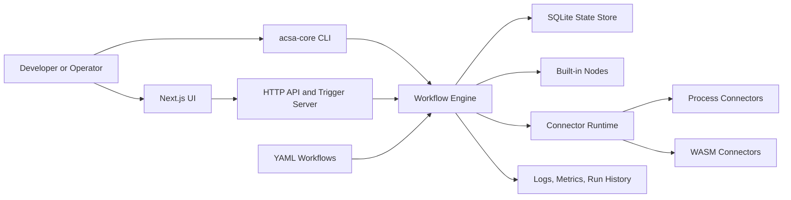
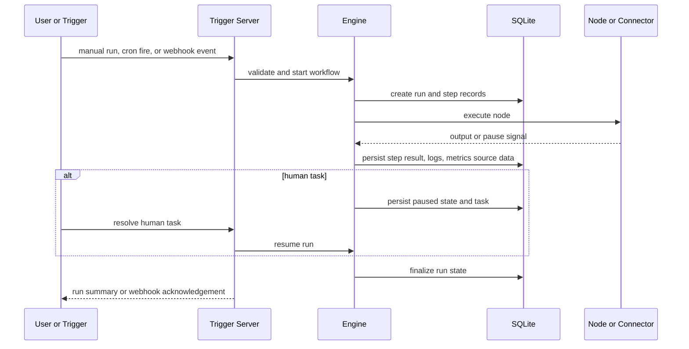

# Architecture Overview

Acsa is a local-first automation platform with a Rust execution engine, YAML workflows, pluggable connectors, and a lightweight Next.js editor. The design prioritizes explicit workflow models, bounded execution, and clear extension points.

## System map

## Main layers

### Workflow model

- Workflows live as YAML files in `workflows/`
- The engine parses YAML into validated internal models
- DAG planning happens before execution begins
- Control-flow nodes can skip branches without breaking graph integrity

### Execution engine

The engine is responsible for:

- schema validation
- DAG compilation and cycle detection
- bounded concurrency
- retries and timeouts
- persisted run and step state
- paused run recovery for human tasks

### Trigger and API layer

The HTTP server exposes:

- workflow CRUD APIs
- manual run APIs
- run history and logs
- human-task resolution
- webhook endpoints
- metrics and health endpoints

Cron workflows are also scheduled through the same runtime.

### Connector layer

Connectors are loaded from manifests and registered into the node registry.

- Process connectors are fast to build and easy to test
- WASM connectors provide the safer default for untrusted extensions

### Storage layer

SQLite stores:

- runs
- step runs
- logs
- trigger state
- human tasks

This keeps Acsa self-hostable without a required external control plane.

## Data flow

## Repository structure

- `core/`
  - engine, storage, nodes, triggers, connectors, CLI, version metadata
- `ui/`
  - visual editor, run history, human-task inbox
- `workflows/`
  - YAML workflow source of truth
- `connectors/`
  - packaged extension entrypoint
- `deploy/`
  - Docker and Kubernetes assets
- `scripts/`
  - install and release packaging helpers
- `packaging/`
  - Homebrew and Scoop manifests

## Design choices

- YAML-first:
  - workflows stay diffable and Git-friendly
- Local-first:
  - SQLite and filesystem workflows keep the default deployment simple
- Modular runtime:
  - built-in nodes, connector runtime, and UI remain separable
- Security-first defaults:
  - secret rejection, log redaction, bounded timeouts, and plugin isolation are built into the architecture
- Extensible API:
  - the UI and CLI both sit on top of the same workflow and run model

## Current limitations

- WASM plugin hardening is partially gated by upstream Extism dependency updates and Wasmtime advisories (RUSTSEC-2026-0020, RUSTSEC-2026-0021, RUSTSEC-2026-0006; medium-severity guest resource exhaustion/panic/segfault edge cases): [Extism issue tracker](https://github.com/extism/extism/issues), [RUSTSEC-2026-0020](https://rustsec.org/advisories/RUSTSEC-2026-0020.html), [RUSTSEC-2026-0021](https://rustsec.org/advisories/RUSTSEC-2026-0021.html), [RUSTSEC-2026-0006](https://rustsec.org/advisories/RUSTSEC-2026-0006.html)
- OS-level memory caps for subprocess connectors are not implemented yet
- The UI focuses on a minimal editor and does not replace YAML review for complex workflows
